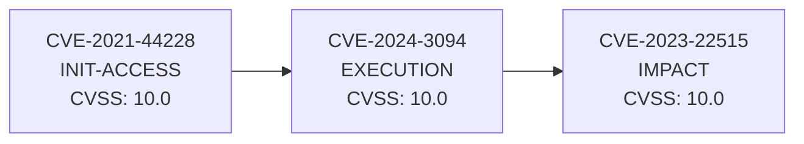

# AttackChainBuilder

Build plausible attack chains from [ExploitHunter](https://github.com/TeoVMP/ExploitHunter) CVE data with MITRE ATT&CK alignment.

AttackChainBuilder consumes ExploitHunter's JSON reports and constructs **attack chains** — ordered sequences of vulnerabilities that, combined, allow an attacker to progress through kill-chain phases (Initial Access → Execution → Privilege Escalation → Lateral Movement → Impact). Each chain is scored and prioritized for blue teams, red teams, and vulnerability management.

## Features

- **Context-driven chain generation**: specify where the attacker is now (e.g., "already intruded, start from pivoting") and the tool builds chains from that phase onward.
- **MITRE ATT&CK alignment**: each CVE is mapped to kill-chain phases (tactics) and specific techniques (T-IDs).
- **Dual scoring**: exploitability product (probability all steps are exploitable) × severity mix (weighted CVSS, coverage, confidence, PoCs, KEV/ransomware bonus).
- **Technical exploitation details**: attack vector, complexity, prerequisites, exploitation method, impact summary, detection opportunities — all extracted from CVSS vector + CWE + description.
- **Viability analysis**: assess whether each chain step has real-world exploitability (weaponized / PoC / theoretical).
- **False positive detection**: flags classification mismatches, theoretical risks, vague descriptions, likely-patched CVEs, and unverified claims.
- **Community PoC search**: optionally search GitHub for verified PoC repositories (stars ≥ 5).
- **Debug mode**: show full classification reasoning, scoring breakdown, and FP flags per CVE.
- **CVE inspector**: detailed single-CVE view with all technical data (`acb inspect`).
- **Multiple output formats**: JSON, Markdown, CSV, Mermaid (.mmd), Graphviz DOT (.dot).
- **Graph visualization**: separate graph files per chain, or merged into a single graph with `--merge-graph`.
- **Optional AI advisor**: classify ambiguous CVEs and generate chain explanations via OpenAI-compatible API (opt-in, stdlib `urllib`, no extra dependencies).
- **Zero runtime dependencies**: stdlib only (Python ≥3.10). Dev: pytest + ruff.
- **Backward-compatible**: works with ExploitHunter JSON from v2.0+ (extended with CVSS vectors and CWE).

## Installation

```bash
cd AttackChainBuilder
pip install -e ".[dev]"
```

## Quick Start

### 1. Generate ExploitHunter data

```bash
exploithunter hunt --year 2026 --format json --output reports/
```

### 2. Build attack chains

```bash
# Basic build
acb build --input reports/exploited_cves_2026_*.json

# Context-driven: attacker already has lateral movement access
acb build --input report.json --start-phase lateral-movement --goal-phase impact

# With full analysis (viability + false positives + technical details)
acb build --input report.json --analyze --details --output reports/

# Debug mode: see classification reasoning and scoring breakdown
acb build --input report.json --debug --top 5

# Search GitHub for community-verified PoCs
acb build --input report.json --search-pocs
```

### 3. Inspect a single CVE

```bash
# Full technical details
acb inspect CVE-2021-44228 --input report.json

# JSON export with community PoC search
acb inspect CVE-2021-44228 --input report.json --search-pocs --format json --output audit/
```

### 4. Audit classification

```bash
acb classify --input report.json
acb classify --input report.json --debug
```

## Usage Reference

### `acb build`

```
acb build --input <file.json> [flags]

Required:
  --input PATH              ExploitHunter JSON report

Context:
  --start-phase PHASE       Where the attacker is now
  --goal-phase PHASE        Target phase to reach (default: impact)
  --software KEYWORDS       Comma-separated target software
  --version-hint TEXT        Version substring match
  --max-steps N             Max chain length (default: 5)
  --min-steps N             Min chain length (default: 2)
  --require-software-link   Hard constraint: all steps must match target software

Analysis:
  --analyze                 Analyze viability and detect false positives
  --details                 Include technical exploitation details in reports
  --search-pocs             Search GitHub for community-verified PoCs (requires network)
  --debug                   Debug mode: show classification reasoning, scoring, FP flags

Filtering:
  --top N                   Show only top N chains
  --min-score N             Minimum chain_score filter
  --allow-unknown           Include CVEs without phase classification

Output:
  --format FORMATS          json,md,csv,mermaid,dot (default: json,md,mermaid)
  --merge-graph             Merge all chains into a single graph file
  --output DIR              Output directory (default: .)
  -q, --quiet               Minimal console output

AI (optional):
  --ai                      Enable LLM advisor (needs ACB_AI_* env vars)
```

### `acb classify`

```
acb classify --input <file.json> [flags]

  --input PATH              ExploitHunter JSON report
  --format FORMAT           Output: table (default) or json
  --output DIR              Output directory (for json format)
  --allow-unknown           Show CVEs without classification
  --debug                   Show classification reasoning per CVE
  -q, --quiet
```

### `acb inspect`

```
acb inspect <CVE-ID> --input <file.json> [flags]

  cve_id                    CVE ID to inspect (e.g. CVE-2021-44228)
  --input PATH              ExploitHunter JSON report
  --search-pocs             Also search GitHub for community PoCs
  --format FORMAT           Output: table (default) or json
  --output DIR              Output directory (for json format)
```

Example output:

```
========================================================================
INSPECT: CVE-2021-44228
========================================================================
Description     : Apache Log4j2 JNDI injection...
CVSS            : 10.0 (CRITICAL)
CVSS Vector     : CVSS:3.1/AV:N/AC:L/PR:N/UI:N/S:C/C:H/I:H/A:H
CWE             : CWE-502, CWE-400, CWE-20

Phase           : INITIAL_ACCESS (HIGH)
Techniques      : T1190, T1059
p(exploit)      : 0.9800
Viability       : HIGH

EXPLOIT DETAILS:
  Attack Vector       : Network
  Attack Complexity   : Low
  Privileges Required : None
  User Interaction    : None
  Method              : Unsafe deserialization
  Prerequisites       : Network access to vulnerable service, No authentication required
  Impact              : Full data exfiltration, complete system compromise, ransomware deployment
  Exploit Maturity    : weaponized

SOURCES:
  [HIGH] cisa-kev
  [MEDIUM] github-advisories

PoCs / EXPLOITS:
  [exploit-db] https://www.exploit-db.com/exploits/50592
  [github-poc] https://github.com/kozmer/log4j-shell-poc
  [metasploit] https://github.com/rapid7/metasploit-framework/...

DETECTION OPPORTUNITIES:
  - WAF: ${jndi:ldap:// patterns
  - DNS: suspicious LDAP lookups
  - Egress filtering on LDAP ports

FALSE POSITIVE FLAGS:
  [MEDIUM] classification_mismatch: CVSS vector suggests INITIAL_ACCESS but keywords suggest EXECUTION.
```

## Environment Variables (AI Advisor)

| Variable | Default | Description |
|----------|---------|-------------|
| `ACB_AI_BASE_URL` | `https://api.openai.com/v1` | OpenAI-compatible API base URL |
| `ACB_AI_API_KEY` | *(required for --ai)* | API key |
| `ACB_AI_MODEL` | `gpt-4o-mini` | Model name |

## Architecture

```
src/attackchainbuilder/
├── __init__.py          # Version
├── __main__.py          # python -m attackchainbuilder
├── cli.py               # argparse CLI: build / classify / inspect
├── models.py            # KillPhase, CveRecord, ChainStep, AttackChain, ExploitDetails
├── loader.py            # Parse ExploitHunter JSON → CveRecord list
├── normalize.py         # Software name normalization (synonyms, tokenization)
├── phases.py            # KillPhase ↔ ATT&CK tactic mapping
├── attack.py            # ~20 curated ATT&CK techniques with keyword triggers
├── classify.py          # CVE → phase + technique (CVSS vector > keywords > CWE)
├── details.py           # Extract technical exploitation details (vector/CWE/description)
├── analyzer.py          # Viability assessment + false positive detection
├── poc_search.py        # GitHub PoC search (optional, requires network)
├── debug.py             # Debug mode output (classification reasoning, scoring)
├── chain.py             # Graph builder + context-driven DFS chain search
├── scoring.py           # exploitability product × severity mix
├── ai.py                # Optional LLM advisor (urllib, OpenAI-compatible)
└── report/
    ├── __init__.py      # Report dispatcher
    ├── json_out.py      # Structured JSON with exploit_details, FP flags, viability
    ├── markdown.py      # Human-readable Markdown with technical details section
    ├── csv_out.py       # Spreadsheet-safe CSV (formula injection protected)
    └── graph.py         # Mermaid (.mmd) + Graphviz DOT (.dot)
```

### Classification Pipeline

Each CVE goes through a priority-based classifier:

1. **CVSS vector metrics** (highest confidence): `AV:N/PR:N` → Initial Access; `PR:L/AV:L` → Privilege Escalation; `S:C` → Lateral Movement.
2. **Description keywords**: curated regex table for RCE, SQLi, LPE, ransomware, etc.
3. **CWE hints**: CWE-89 → SQL Injection; CWE-78 → Command Injection; etc.
4. **Fallback**: `None` (excluded unless `--allow-unknown`).

### Technical Details Extraction

From CVSS vector + CWE + description, each CVE gets:

| Field | Source |
|-------|--------|
| Attack Vector (Network/Local/Physical) | CVSS AV metric |
| Attack Complexity (Low/High) | CVSS AC metric |
| Privileges Required (None/Low/High) | CVSS PR metric |
| User Interaction (None/Required) | CVSS UI metric |
| Exploitation Method | CWE mapping + description keywords |
| Prerequisites | Derived from AV + PR + UI + AC |
| Impact Summary | Derived from C + I + A + scope + description |
| Detection Opportunities | Mapped from exploitation method |
| Exploit Maturity | PoC types: metasploit/exploit-db → weaponized; github-poc → poc; none → theoretical |

### False Positive Detection

The analyzer flags potential issues:

| Flag | Severity | Trigger |
|------|----------|---------|
| `theoretical_risk` | MEDIUM | CVSS ≥ 9.0 but no PoCs |
| `uncertain_classification` | HIGH | Phase confidence = LOW |
| `classification_mismatch` | MEDIUM | Vector and keywords disagree on phase |
| `likely_patched` | LOW | Published before 2020, not in CISA KEV |
| `vague_description` | LOW | Description < 50 chars |
| `unverified_ransomware` | MEDIUM | Ransomware claimed but no PoC/KEV |
| `no_software_info` | LOW | No affected software listed |

### Scoring

```
per_step: p_exploit = clamp(base × confidence_mult + poc_bonus + kev_bonus, 0.05, 0.98)
chain:    exploitability = ∏ p_exploit(step)
          severity_mix = 0.4×CVSS + 0.25×coverage + 0.2×confidence + 0.15×PoC_richness + bonus
          chain_score = 100 × √(exploitability × severity_mix)
          viability = HIGH / MEDIUM / LOW (per-step worst case)
```

## Example Output

### Console (with --analyze --details)

```
========================================================================
TOP 5 ATTACK CHAINS:
------------------------------------------------------------------------
 1. CVE-2021-44228 (INIT-ACCESS) → CVE-2024-3094 (EXECUTION) → CVE-2023-22515 (IMPACT)
    Score: 97.0 | Exploitability: 94.1% | Coverage: 43% | Viability: MEDIUM | FP flags: 3
    ATT&CK: T1190, T1059 → T1059, T1210 → T1190, T1068
    [1] CVE-2021-44228: Unsafe deserialization | maturity=weaponized
        prereqs: Network access to vulnerable service, No authentication required
        impact: Full data exfiltration, complete system compromise, ransomware deployment
        FP: [MEDIUM] classification_mismatch
```

### Mermaid Graph (top chain)



## Development

```bash
cd AttackChainBuilder
pip install -e ".[dev]"
pytest          # test suite (offline, mocked HTTP)
ruff check .    # linting
```

## Integration with ExploitHunter

ExploitHunter v2.0+ exports `cvss_vector` and `cwe` fields in its JSON reports, which AttackChainBuilder uses for high-confidence phase classification and technical detail extraction. If your ExploitHunter JSON was generated with an older version (missing these fields), AttackChainBuilder falls back to keyword and CWE-based classification.

## License

MIT
